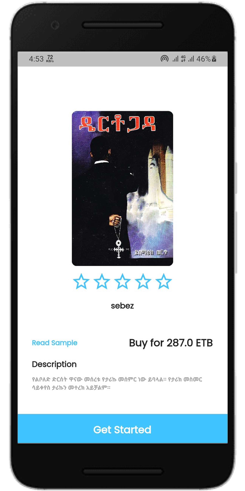
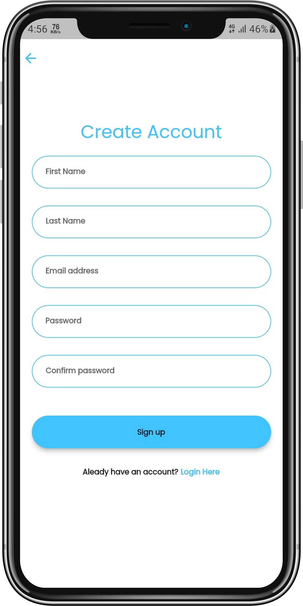
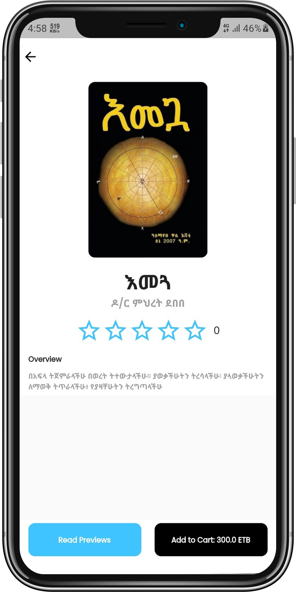
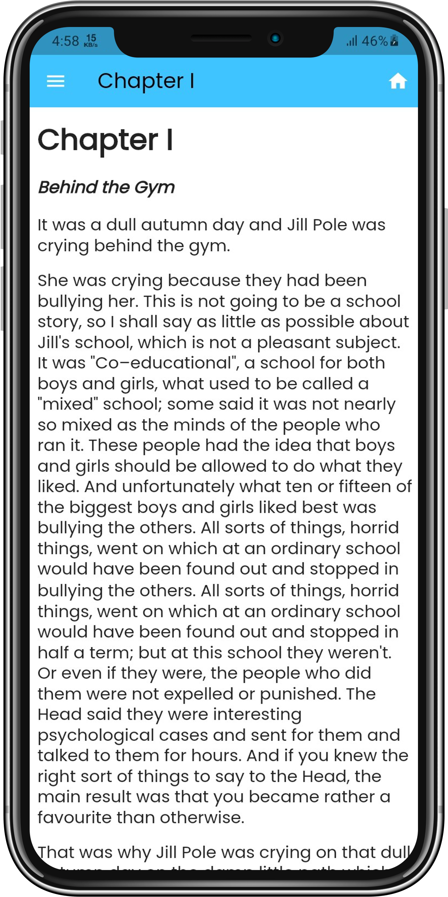

 

  <h3 align="left">Introduction</h3>
  
This application is an ecommerce application that only sells ebooks, created using the GraphQL API, Hasura GraphQL Engine, and the Flutter framework. Books are available in epub format, so most of the books are less than 1 MB. The app also have built in epub reader.Customers can search books, browse books, view descriptions, read samples of the books, and if they decide they want to buy them, they can do so by conducting a chapa payment transaction through this app.

  <h3 align="left">Android Screenshots</h3>

<table>
  <tr>
    <td>Landing Screen</td>
     <td>Signup Screen</td>
     <td>Login Screen</td>
  </tr>
  <tr>
    <td></td>
    <td></td>
    <td></td>
  </tr>
 </table>
 
 <table>
  <tr>
    <td>Browse Books Screen</td>
     <td>Book Detail Screen</td>
     <td>Cart Screen</td>
  </tr>
  <tr>
    <td></td>
    <td></td>
    <td></td>
  </tr>
 </table>
 
 <table>
  <tr>
    <td>Epub Reader Screen</td>
     <td>Book Chapters Drawer</td>
     <td>Profile Screen</td>
  </tr>
  <tr>
    <td></td>
    <td></td>
    <td></td>
  </tr>
 </table>

  <h3 align="left">iPhone Screenshots</h3>

<table>
  <tr>
    <td>Landing Screen</td>
     <td>Signup Screen</td>
     <td>Login Screen</td>
  </tr>
  <tr>
    <td></td>
    <td></td>
    <td></td>
  </tr>
 </table>
 
 <table>
  <tr>
    <td>Browse Books Screen</td>
     <td>Book Detail Screen</td>
     <td>Cart Screen</td>
  </tr>
  <tr>
    <td></td>
    <td></td>
    <td></td>
  </tr>
 </table>
 
 <table>
  <tr>
    <td>Epub Reader Screen</td>
     <td>Book Chapters Drawer</td>
     <td>Profile Screen</td>
  </tr>
  <tr>
    <td></td>
    <td></td>
    <td></td>
  </tr>
 </table>

<!-- CONTACT -->
## Contact

Daniel Demelash-  danieldemelash5@gmail.com
